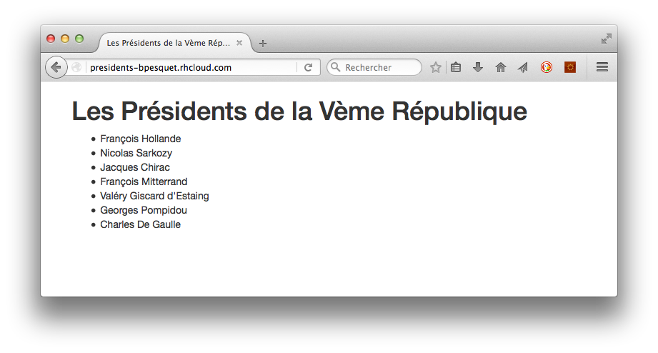

[OpenShift](https://www.openshift.com) est une plate-forme de publication d'applications de type [PaaS](https://fr.wikipedia.org/wiki/Plate-forme_en_tant_que_service) concue par la société [RedHat](http://www.redhat.com/). 

{:.centered}

Elle permet de déployer grauitement jusqu'à trois applications et supporte de nombreux environnements : Java, Ruby, Python, PHP, Node.js, etc. 

Nous allons l'utiliser pour déployer un site PHP d'exemple utilisant Bootstrap et MySQL.

## Création du projet local

* Créez un répertoire `presidents` dans le répertoire de travail de votre serveur Web local.

* Dans ce répertoire, créez un site Web permettant d'afficher la liste des présidents de la Vème République. La librairie Bootstrap est utilisée pour améliorer la présentation. Les informations sur les présidents sont récupérées depuis une base de données MySQL. Les scripts SQL ci-dessous vous permettront de créer cette base.

~~~
create database if not exists presidents character set utf8 collate utf8_unicode_ci;
use presidents;

grant all privileges on presidents.* to 'presidents_user'@'localhost' identified by 'secret';
~~~

~~~
drop table if exists president;

create table president (
    pres_id integer primary key auto_increment,
    last_name varchar(100) not null,
    first_name varchar(100) not null,
    year_birth integer not null
) engine=innodb character set utf8 collate utf8_unicode_ci;
~~~

~~~
insert into president values (1, 'De Gaulle', 'Charles', 1890);
insert into president values (2, 'Pompidou', 'Georges', 1911);
insert into president values (3, "Giscard d'Estaing", 'Valéry', 1926);
insert into president values (4, 'Mitterrand', 'François', 1926);
insert into president values (5, 'Chirac', 'Jacques', 1932);
insert into president values (6, 'Sarkozy', 'Nicolas', 1955);
insert into president values (7, 'Hollande', 'François', 1954);
~~~

Vous devez obtenir le résultat suivant.

{:.centered}

* Créez un nouveau dépôt Git dans le répertoire `presidents` et ajoutez-y le code source du projet.

## Création d'une nouvelle application sur OpenShift

* Créez votre compte sur [OpenShift](https://www.openshift.com/app/account).

* Installez sur votre machine locale les [outils client OpenShift](https://developers.openshift.com/en/managing-client-tools.html), appelés **rhc**.

    * Si vous êtes sous Windows, suivez pas-à-pas la [documentation OpenShift](https://developers.openshift.com/en/getting-started-windows.html) pour vous guider.

    * Choisissez la version 2.1.7 de Ruby.

    * Après l'installation de Ruby, éditez le fichier `C:\Ruby21-x64\lib\ruby\2.1.0\win32\registry.rb` et modifiez la ligne 70 comme indiqué ci-dessous.

~~~
#LOCALE = Encoding.find(Encoding.locale_charmap)
LOCALE = Encoding::UTF_8
~~~

* Une fois les outils **rhc** installés, ouvrez un terminal puis tapez la commande suivante pour lancer leur configuration (le `$` représente l'invite de commande et ne doit pas être tapé).

~~~
$ rhc setup
~~~    

* Laissez le nom de serveur par défaut, puis continuez la procédure en saisissant votre login/mot de passe OpenShift et en répondant `yes` aux questions posées. Choisissez un nom unique comme *namespace* (exemple : **bpesquet**). Les outils OpenShift sont maintenant installés sur votre machine.

* Connectez-vous sur [OpenShift](https://openshift.redhat.com/app/login) puis choisissez de créer une nouvelle application. Sélectionnez PHP 5.4 puis saisissez `presidents` dans l'URL publique de la nouvelle application. 

{:.centered}

* Gardez tous les autres choix par défaut puis cliquez sur le bouton **Create Application**. Au bout de quelques dizaines de secondes, l'application OpenShift est créée. Cliquez sur *Continue to the application overview page* pour arriver sur le tableau de bord de la nouvelle application.

{:.centered}

* Ajoutez MySQL 5.5 à votre application en cliquant sur le lien associé.

{:.centered}

* Cliquez sur le bouton **Add Cartridge**. Au bout de quelques dizaines de secondes, une base de données MySQL est ajoutée à votre application. Un utilisateur dédié permet de s'y connecter. 

* Cliquez sur le lien *Add phpMyAdmin 4.0* pour ajouter l'outil d'administration phpMyAdmin.

{:.centered}

* Cliquez sur le bouton **Add Cartridge**. Au bout de quelques dizaines de secondes, phpMyAdmin est ajouté à votre application.

{:.centered}

## Lien avec le projet local

Une application OpenShift correspond à un dépôt Git hébergé chez OpenShift. Pour pouvoir déployer une application existante, il faut lier son dépôt Git local au dépôt distant OpenShift.

* Allez sur votre [tableau de bord OpenShift](https://openshift.redhat.com/app/console/applications), cliquez sur votre application `presidents` puis copiez l'URL de son dépôt (elle est de type `ssh://...`).

    * Si OpenShift vous indique que vous devez d'abord importer une clé SSH, cliquez sur l'onglet **Settings** pour vérifier la présence de cette clé, puis revenez à votre application.

* Dans un terminal, déplacez-vous dans le répertoire du projet `presidents`. Tapez successivement les commandes suivantes.

~~~
$ git remote add openshift <url_depot_openshift>
$ git fetch openshift
$ git merge openshift/master -s recursive -X ours
~~~

Le répertoire `.openshift` contient maintenant tous les paramètres liés à OpenShift.

* Lorsque le site est déployé sur OpenShift, sa base de données MySQL n'est pas locale mais hébergée sur une autre machine gérée par OpenShift. Les paramètres d'accès à la BD depuis le code PHP doivent évoluer. On peut les récupérer via des variables d'environnement définies par OpenShift.

~~~
<?php

// MySQL config for OpenShift
$dbHost = getenv('OPENSHIFT_MYSQL_DB_HOST');
$dbName = getenv('OPENSHIFT_GEAR_NAME');
$dbUser = getenv('OPENSHIFT_MYSQL_DB_USERNAME');
$dbPassword = getenv('OPENSHIFT_MYSQL_DB_PASSWORD');
~~~

* Modifiez votre code PHP afin que la connexion à MySQL se fasse en utilisant les paramètres ci-dessus, puis committez vos modifications dans le dépôt Git local.

* Tapez la commande suivante pour déployer votre projet sur OpenShift.

~~~
$ git push openshift master
~~~

Il ne reste plus qu'à implanter le schéma de la base de données sur OpenShift.

* Allez sur votre [tableau de bord OpenShift](https://openshift.redhat.com/app/console/applications), cliquez sur votre application `presidents` puis notez le login et le mot de passe de votre base de données.

* Dans un autre onglet, ouvrez l'URL https://presidents-VotreCompteOpenShift.rhcloud.com/phpmyadmin/. Saisissez le login/mot de passe demandés. Vous accédez à l'accueil de phpMyAdmin.

{:.centered}

* La base `presidents` a déjà été créée. Importez les scripts `structure.sql` et `content.sql` pour créer le schéma BD et les données de test.

* A présent, accédez à l'URL https://presidents-VotreCompteOpenShift.rhcloud.com. Le site fonctionne sur OpenShift !

{:.centered}

## Modifications ultérieures

Une fois la configuration initiale effectuée, le déploiement de nouvelles modifications se fait en les committant dans le dépôt local, puis en lançant la commande :

~~~
$ git push openshift master
~~~

Il faudra jongler entre les configurations "BD locale" et "BD OpenShift" pour pouvoir tester localement puis déployer sur OpenShift.

## Exercice

* Modifiez le site pour qu'il affiche les dates de naissance des Présidents, puis déployez vos modifications sur OpenShift.

{:.centered}
