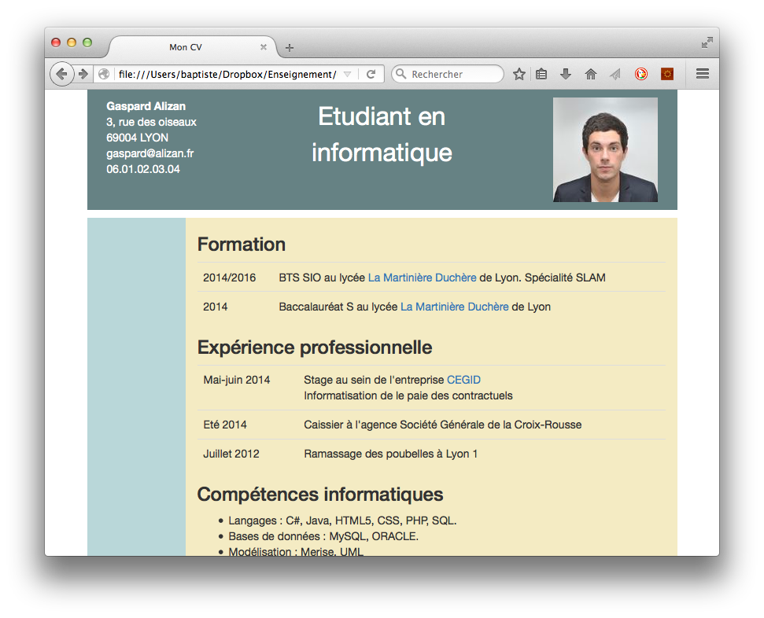
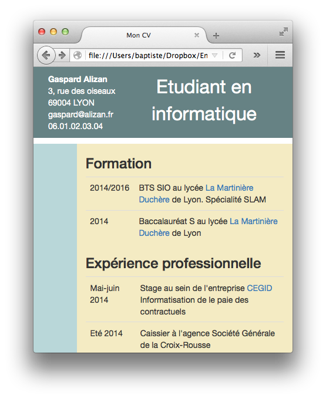
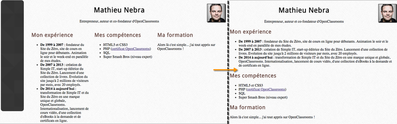

L'objectif de ce projet est de concevoir votre CV sous la forme d'une page Web.

## Contenu du CV

Pour réaliser ce projet, commencez par réfléchir au contenu de votre CV. Traditionnellement, un CV est organisé selon trois rubriques principales : 

### Formation

Elle décrit votre parcours de formation. Vous indiquerez l'ordre antichronologique (le plus récent en premier).

### Expérience professionnelle

Utilisez l'ordre antichronologique pour faire apparaître en premiers les expériences les plus récentes. Evitez les listes à rallonge (pas besoin de remonter trop loin dans le passé).

### Compétences

Vous mentionnerez les compétences professionnelles déjà acquises ou encours d'acquisition cette année.

### En-tête
Outre les trois rubriques précédentes, votre CV devra comporter un en-tête avec les informations suivantes :

* Vos coordonnées (nom/prénom + éventuellement adresse postale, téléphone, courriel).
* Une petite photo d'identité.
* Un titre résumant votre situation actuelle, par exemple "Etudiant ingénieur en informatique".

## Structure du CV

Un CV est un document structuré. Votre page Web doit refléter cette structure par un choix de balises adaptées au contenu présenté. Revoyez les chapitres sur le design Web pour trouver les bonnes balises à utiliser.

## Mise en forme du CV

La mise en forme de votre CV est libre. Vous pouvez opter pour une mise en forme classique (rubriques les unes sous les autres) ou bien plus moderne avec une marge à gauche ou à droite et un look plus moderne. A vous de travailler avec les couleurs et les polices pour obtenir un résultat convaincant.

Vous pouvez utiliser Bootstrap pour faciliter la mise en forme et rendre le résultat adaptatif.

## Exemples de résultat

Les images ci-dessous fournissent des exemples de réalisation du projet. La mise en forme (polices, couleurs, etc) peut être modifiée.

{:.centered}

{:.centered}

{:.centered}

