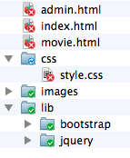

## Exigences métier

L'objectif de ce projet est de créer une application de gestion de films sous la forme d'un site Web statique. 

Deux pages du site doivent être réalisées :

* La page d'accueil `index.html` qui affiche la liste des films.
* La page `movie.html`, accessible un cliquant sur le titre d'un des films sur la page d'accueil, qui présente les détails sur un film ainsi qu'une image et un bouton d'édition (non fonctionnel).

Le site dispose d'une barre de navigation avec un menu déroulant. La seule fonctionnalité opérationnelle de cette barre est le retour à la page d'accueil. Un pied de page (*footer*) indique la nom du créateur du site.

Les données du site (les films) sont choisies librement, avec un minimum de trois films affichés.

## Exigences techniques

Le site utilise les technologies HTMLS, CSS ainsi que le framework Bootstrap. Il exploite les fonctionnalités de Bootstrap afin de s'adapter au terminal d'affichage (*responsive design*) et d'offrir un rendu moderne.

Le code HTML et CSS doit être conforme aux standards et indenté correctement.

Le site est réalisé dans un répertoire nommé `mymovies-static`. L'arborescence de ce répertoire doit être la suivante :

{:.centered}

## Exemple de résultat

Les images ci-dessous fournissent un exemple de réalisation du projet. La mise en forme (polices, couleurs, etc) peut être modifiée.

{:.centered}

{:.centered}

{:.centered}
